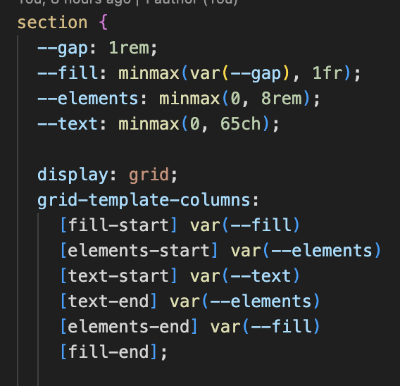

# Reflektion

### Responsivitet

Der er meget få ting, i min kode som er responsivt på nuværende tidspunkt.

#### Visualisering

Jeg har følt, at det var svært at visualisere hvordan mobilversionen, når jeg kun havde webversionen at gå ud fra.
Det mest svære ved visualiseringen var ikke hvordan jeg skulle forstille mig elementerne skulle se ud. Men hvordan jeg fik skrevet koden ordenligt, så det er til at lave responsivt.
I forhold til at stille koden op, på en overskuelig måde til et responsivitet design, føltes til at fungere i starten. Men til tider har jeg følt, at min koden er blevet mere u overskueligt, da man har komponenter inde i komponenter inde i sider.

#### Kodning

**@Layers**
Jeg synes `@Layers` er mega smart, det kræver dog lidt tilvænning at bruge. Når jeg har inspecieret en side eller et element, for at finde ud af, hvorfor noget kode ikke virker, kan jeg ikke se, hvor jeg har brugt det styling, andet end jeg kan se hvilket lag det er brugt i. Dette kan gøre det lidt uoverskueligt at navigere i, når jeg er vant til at kunne at der er styling fx. _index linje 120._

**SubGrid**

Lidt ligesom `@Layers` synes jeg det er lidt svært at bruge subgrid, da man skal have defineret et fyldestgørende grid fra starten af.
Jeg har sat et grid op på CaseStudy siden, og et dertilhørende subgrid, for at kunne placere den



**Selectorer**
Jeg føler ikke jeg har den samme grundforståelse for kode, som er forventet. Jeg er interesseret i at bruge selectorer noget mere, men er ikke rigtigt blevet præsenteret for dem, andet det vi blev i starten af valgfaget. Jeg vil dog gerne blive bedre til at bruge dem.

**Nesting**
Nesting har jeg følt har været det mest simple, vi har lært indtil videre. Selvfølgelig handler det om at finde ud af, hvor det giver mening, men det kommer.

Dertil kommer container queries hvilket jeg lige skal tænke mig om, en ekstra gang, da i dette tilfælde, så forholder `#cardbar`sig ikke til hele viewporten, men fx. kun den omkringliggende `<div/>`.

````CSS
@container (width < 800px) {
        #cardbar {
          flex-direction: column;
          grid-row: 5;
        }
      }```

#### Overordnet reflektion

Jeg synes allerede at valgfaget kan være en lille smule udfordrende - På den gode måde.
Indtil nu har jeg følt, at jeg ikke har været specielt udfordret, så det er mega fedt, at få testet mine evner, selvom der har været virkelig meget, på kort tid.
````
